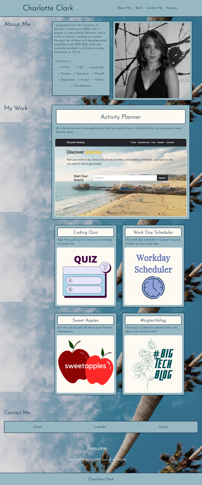

# charlotteportfolio

## Technologies Used:

* HTML
* CSS 

## Goal: 

There are four sections in my portfolio. 
* In the "About me", you will find my name, a recent photo, and a short bio.
* In the "My work" section, you will find titled images of my previous works
* In the "Contact" section, you will find interactive links with my email, phone number, LinkedIn, and Github
* In the "Resume" section, you will find a pdf copy of my resume

To navigate the site, if you click the links in the navigation, each link will bring you to the corresponding part of the webpage. 

If you click on the images in the "My Work" section of the page, you will be taken to that deployed application. 

This site is made with a responsive layout that adapts to different screens and devices. 

https://charlocc.github.io/charlotteportfolio/

